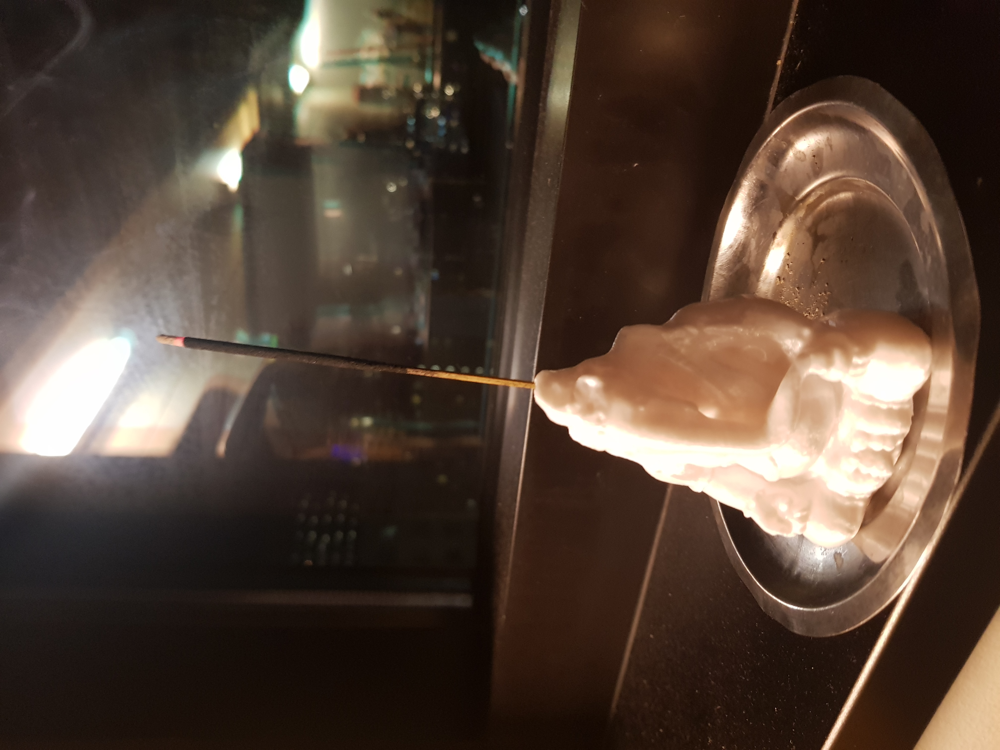

# ganesha_mod
Modifying a Ganesha 3d Model from Thingiverse. The original is [here](https://www.thingiverse.com/thing:71422) and I added a hole in the head of Ganesha to hold incense. I angled the hole slightly so that incense doesn't drop far behind Ganesha, but doesn't drop on him either. I also made him bigger--he's now about about 85mm tall. STL file in repo, but also in the remix!

